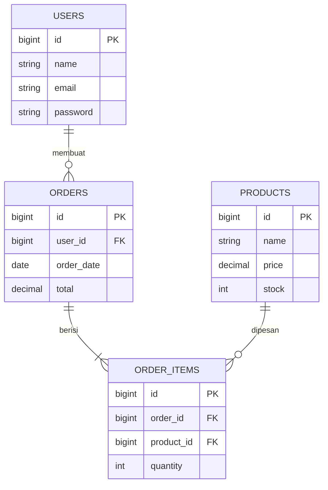

## Assignment

Assignment 2: Design Database ERD.

| | |
|---|---|
| **Student** | (Muhammad Rizky) |
| **NPM** | (2410010226) |
| **Class** | (5C) |
| **Phase** | P02: Design Database ERD |
| **Status** | Done |
| **Fork / branch** | https://github.com/rizkymhmd06/Tugas-1-PBO-2 / feature/design-database |

## What was done

| Job | Description | Status |
|---|---|---|
| J1 | Add Name and NPM to README | Done |
| J2 | Add Design Database ERD | Done |

## Design Database ERD

